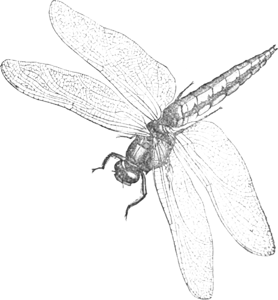

    

<h1 align="center">
  European dragonflies
</h1>
<h2>A Gatsby site project</h2>

<h3>About this site</h3>
    

      This is a site about the dragonflies of Europe. The data for the site
      comes from this API: https://dragonsgraphqlapi.jonasmyrenas.now.sh/.
    

    <h4>Main sources</h4>
    <ul>
      <li>
        Atlas of the European Dragonflies and Damselflies, Jean-Pierre
        Boudot(Editor), Vincent J Kalkman(Editor), Fons Peels(Illustrator)
      </li>
      <li>
        Dragonflies and Damselflies of Europe: A scientific approach to the
        identification of European Odonata without capture, Galliani, C.;
        Scherini, R.; Piglia, A.
      </li>
      <li>
        Field guide to the dargonflies of Brittain and Europe, Klaas-Douwe B
        Dijkstra.
      </li>
      <li>Nordens trollsländor, M. Billqvist, D. Andersson, C. Bergendorff</li>
    </ul>
    
These are all excellent books, go get them if you don't have them.

    <h4>Work in progress</h4>
    

      This is a work in progress, not many species are covered yet. If you like
      to contribute, please contact jonas@myrenas.se for details on how to help.
    
